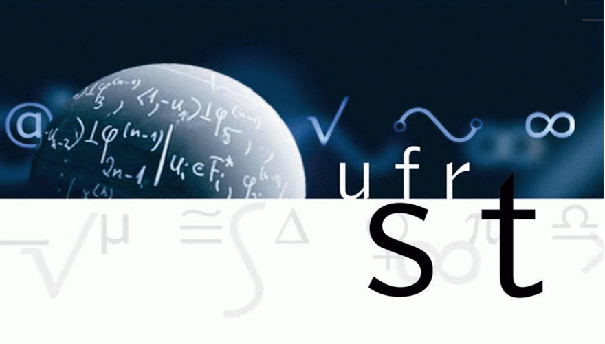

Roguelike
=========
Rapport de projet
-----------------

**Jérémy Bourdé - Jules Wacquier**

*Encadrant : Julien Bernard*

2015 - 2016 

-------------------

1. Qu’est-ce qu’un Roguelike ?
2. Notre Roguelike
	* Background et gameplay
	* Les technologies utilisées
	* Modélisation du jeu
3. Réalisations
	1. Génération procédurale
		* Bruit de Perlin
		* Étagement altitudinal
	2. Modélisation de l'environement
		* Background
		* Obstacle
		* Objectifs
	3. Gameplay et Interface
		* Le personnage
		* Les ennemies
		* L’interface
* Bilan

